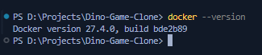
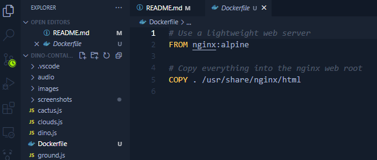
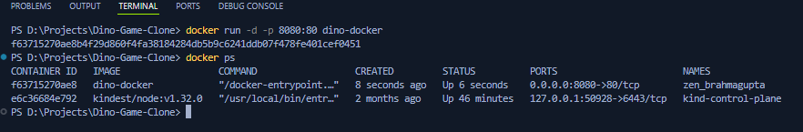
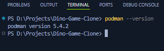
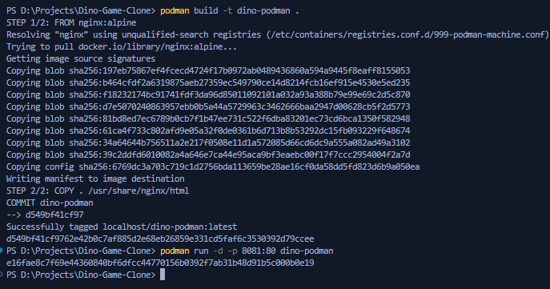
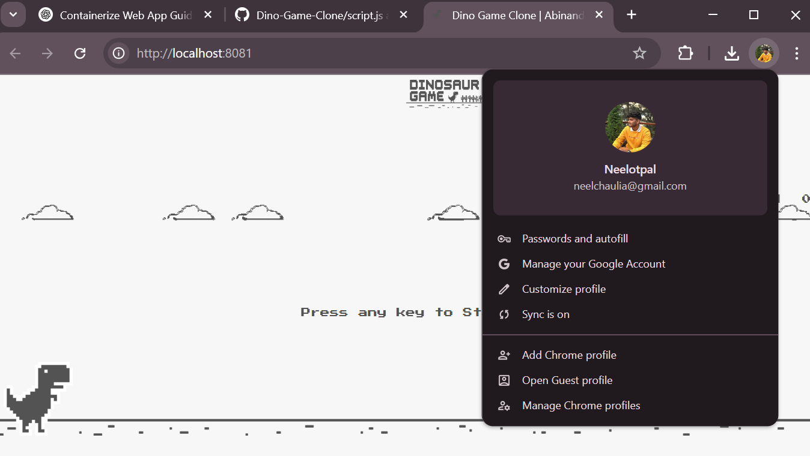

# 🦖 Dino Game – Containerized using Docker and Podman

This project demonstrates how to containerize a simple HTML/CSS/JS Dino Game using **Docker** and **Podman**, two powerful containerization platforms. The game replicates the classic Chrome offline dino game and runs entirely in the browser with no backend.

> ✅ This project is part of my DevOps and containerization learning journey and fulfills an academic assignment demonstrating skills in Docker, Podman, container builds, and GitHub documentation.


## 📚 Table of Contents

- [🦖 Dino Game – Containerized using Docker and Podman](#-dino-game--containerized-using-docker-and-podman)
  - [📚 Table of Contents](#-table-of-contents)
  - [📌 Project Overview](#-project-overview)
  - [🛠️ Tech Stack](#️-tech-stack)
  - [📁 Folder Structure](#-folder-structure)
  - [📥 Prerequisites](#-prerequisites)
  - [⚙️ Step-by-Step Instructions](#️-step-by-step-instructions)
    - [🔹 Docker](#-docker)
      - [1. Create a Dockerfile](#1-create-a-dockerfile)
      - [2. Build Docker Image](#2-build-docker-image)
      - [3. Run Docker Container](#3-run-docker-container)
    - [🔹 Podman](#-podman)
      - [1. Open WSL/Podman Terminal](#1-open-wslpodman-terminal)
      - [2. Build Podman Image](#2-build-podman-image)
      - [3. Run Podman Container](#3-run-podman-container)
  - [📸 Screenshots](#-screenshots)
    - [Docker (`screenshots/docker/`)](#docker-screenshotsdocker)
    - [Podman (`screenshots/podman/`)](#podman-screenshotspodman)
  - [📘 What I Learned](#-what-i-learned)
  - [🙋 About Me](#-about-me)

## 📌 Project Overview

This project:
- Clones the [Dino Game](https://github.com/AbinandhMJ/Dino-Game-Clone)
- Adds a Dockerfile to containerize it with **Docker** and **Podman**
- Runs the game in a browser via an Nginx web server
- Includes organized screenshots of every major step
- Documents the entire process in this markdown file

## 🛠️ Tech Stack

| Technology | Purpose                    |
|------------|-----------------------------|
| HTML/CSS/JS | Frontend Dino Game         |
| Docker      | Container platform (Platform 1) |
| Podman      | Container platform (Platform 2) |
| Nginx       | Static file web server     |
| Git/GitHub  | Version control & hosting  |

## 📁 Folder Structure

```
dino-containerization-project/
├── Dockerfile
├── index.html
├── style.css
├── script.js
├── <other JS/CSS/assets>
├── screenshots/
│ ├── docker/
│ │ ├── browser_output.png
│ │ ├── build.png
│ │ ├── docker_installation.png
│ │ ├── run.png
│ │ └── dockerfile_created.png
│ ├── podman/
│ │ ├── build_run.png
│ │ ├── podman_browser.png
│ │ └── podman_installation.png
│ └── app_download.png
└── README.md
```

## 📥 Prerequisites

- [x] Docker Desktop installed
- [x] Podman Desktop or WSL with Podman CLI
- [x] Git installed
- [x] VS Code or any code editor

## ⚙️ Step-by-Step Instructions

### 🔹 Docker

#### 1. Create a Dockerfile

```Dockerfile
FROM nginx:alpine
COPY . /usr/share/nginx/html
```

#### 2. Build Docker Image

```PowerShell
docker build -t dino-docker .
```

#### 3. Run Docker Container

```PowerShell
docker run -d -p 8080:80 dino-docker
```

- [x] Visit the game at http://localhost:8080

---

### 🔹 Podman

#### 1. Open WSL/Podman Terminal
- Make sure Podman CLI is accessible via your terminal.

#### 2. Build Podman Image

```PowerShell
podman build -t dino-podman .
```

#### 3. Run Podman Container

```PowerShell
podman run -d -p 8081:80 dino-podman
```

- [x] Visit the game at http://localhost:8081

## 📸 Screenshots

Screenshots of each stage are provided in the `screenshots/` directory.

### Docker (`screenshots/docker/`)
- Docker successfully installed ✅
  
  

- Dockerfile added to project ✅
  
  

- Image built using Docker ✅

  

- Game running in the browser via Docker container ✅

  

  


### Podman (`screenshots/podman/`)
- Podman installed and working via terminal ✅

  

- The same Dockerfile that had been used earlier is being reused with Podman
  
- Podman image built and running successfully ✅

  

- Game accessible via browser on Podman container ✅

  

## 📘 What I Learned

Through this project, I gained hands-on experience with:

- Writing a minimal **Dockerfile** using Nginx for serving static files
- Building container images using both **Docker** and **Podman**
- Running web applications inside containers and accessing them via browser
- Using **PowerShell** and **Podman CLI** for container operations
- Organizing screenshots and structuring a project repository for readability
- Writing detailed documentation using Markdown for GitHub visibility

This assignment helped me understand core DevOps workflows and how containerization simplifies application deployment across platforms.

## 🙋 About Me

**Neelotpal**  
🎓 Postgraduate Cloud Computing Student at Loyalist College, Toronto  
🛠️ Cloud Intern | AZ-104 | DevOps & Containers Enthusiast  
📫 [GitHub](https://github.com/neelotpalchaulia)  
🔗 [LinkedIn](https://www.linkedin.com/in/neelchaulia)

> I created this project as part of a hands-on assignment to demonstrate my understanding of containerization using Docker and Podman. I hope this helps others who are starting their DevOps journey!
